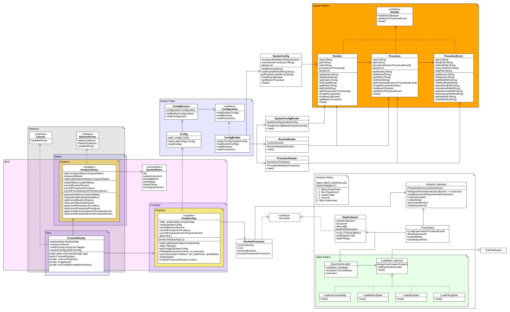

# AnalyzerApp

# GitHub Link:


# Application Description

<p>In the semiconductor industry, great care is taken to apply highly maintainable and repeatable production processes.  Deviation from the process can lead to scrapping parts, which means loss material and money.  Wafer fabrication facilities around the world will spend a great deal of money for metrology tools and applications to maintain this high degree of process control.  One of the major steps in chip production is the metal deposition step, usually done with a semi conductive metal such as copper.  These plated metals on the silicon wafers will provide the necessary electrical pathways that will later become integrated circuits.  In many cases, the size of the deposited trenches or vias can be measured at the nanometer scale.  To accomplish this type of copper deposition process while maintaining product integrity organic materials must be used control the copper reduction process.  To measure these organic compounds electrochemical analytical techniques are used.  The electrochemical experiments are controlled using devices called a potentiostats.</p> 
<p>The analyzer app is the beginning steps and wire framing of application that will be used to control a potentiostat. The application must be able to read complex configuration files.  These files will be used to send the information to the external potentiostat equipment, which will run the experiment and then the analyzer app will need to collect the data.  </p>
<p>Design goals consist of building an application that will abstract the complexity of performing its tasks away from the client code.   The code that interacts with the potentiostat should not be apparent to the main Analyzer App Class. This approach allows us to make changes in the future to the equipment without the need to change our code.  The information that is needed to run an experiment requires complex objects to be created in our application.  In the past applications, we have written this into libraries that communicate with each specific equipment, making them not robust and needed change every time equipment was substituted. To create a more flexible approach this application will read the configurations from the main app and abstract this by using the builder pattern.  The necessary information can be passed to the analyzer and processed or mapped at specific analyzer level, but will not require changing our configuration file reader.</p>
<p>The Builder pattern allows us to create a specific builder for the current configuration.  If and when the configuration needs altering we can simply replace the concrete builder that uses new readers or parts of readers, without the need to rebuild the main configuration initialization reader.</p>
<p>We also utilize the iterator patterns for each part of the configuration, which makes iterating through each step simpler than using just for loops.  We can also access and update each member individually without the need of keeping track of indexes as this is managed inside each class.</p>
<p>The Singleton Pattern was used to make sure that only one instance of the app can be instantiated.  Clients can also access this main hub to get whatever data they need via the static getter.   This will serves the main core of the application and the controller for the MVC pattern.  An Analyzer Status singleton is also created that will be used to update the display.  In this iteration, it is a simple console display.  To Aid communication between the model and console display console can subscribe to the Status informer, which follows the observer pattern.  When the Analyzer Status members are updated, we also will update our listeners and consequently the Console Display will be updated.   Within the Analyzer itself, we utilize the state pattern to send the necessary files to the potentiostat. By using these approaches we abstract the Analyzer itself and make main classes only interact with this abstract Analyzer class.</p>
<p>Code duplication is avoided by the use of inheritance and specifically abstract classes.  Shared code can be found in the super classes and individual implementation are in the sub classes.  Mechanisms that are used in multiple places are centralized and shared by multiple objects.  This is limiting the number of places that code will need to be changed in the event new features or changes must be introduced.</p>


# Assumptions:
<ol>
<li>All configuration a simulated and no files are read from the the hdd</li>
<li>All drilled down implementation a just simulated.</li>
<li>Data returned from the potentiostat is simulated</li>
<li>the project is designed as a wire frame for further expansion and specific implementation must be added</li>
<li>Only a console app is provide at this time users can run the simulation</li>
<li>The simulation consists of three routines.</li>
<li>Each routine consists of procedures</li>
<li>Each procedure consists of procedure events</li>
<li>procedure events contains paths to files that define the experiment for the potentiostat</li>
<li>once a procedure event data is loaded to the potentiostat an experiment can run</li>
<li>once a procedure event data is loaded to the potentiostat an experiment can run</li>
<li>Data can be collected when the experiment is running</li>
<li>Data Collector must be run on a separate thread and communicate with the Analyzer App in a thread safe manner</li>
<li>Processing a routine should be executed on a dedicated thread</li>
</ol>


# Analyzer App Class Diagram


# Project Template

This is a Java Maven Project Template


# How to compile the project

We use Apache Maven to compile and run this project. 

You need to install Apache Maven (https://maven.apache.org/)  on your system. 

Type on the command line: 

```bash
mvn clean compile
```

# How to create a binary runnable package 


```bash
mvn clean compile assembly:single
```


# How to run

```bash
mvn -q clean compile exec:java -Dexec.executable="edu.bu.met.cs665.Main" -Dlog4j.configuration="file:log4j.properties"
```

# Run all the unit test classes.


```bash
mvn clean compile test checkstyle:check  spotbugs:check
```

# Using Spotbugs to find bugs in your project 

To see bug detail using the Findbugs GUI, use the following command "mvn findbugs:gui"

Or you can create a XML report by using  


```bash
mvn spotbugs:gui 
```

or 


```bash
mvn spotbugs:spotbugs
```


```bash
mvn spotbugs:check 
```

check goal runs analysis like spotbugs goal, and make the build failed if it found any bugs. 


For more info see 
https://spotbugs.readthedocs.io/en/latest/maven.html


SpotBugs https://spotbugs.github.io/ is the spiritual successor of FindBugs.


# Run Checkstyle 

CheckStyle code styling configuration files are in config/ directory. Maven checkstyle plugin is set to use google code style. 
You can change it to other styles like sun checkstyle. 

To analyze this example using CheckStyle run 

```bash
mvn checkstyle:check
```

This will generate a report in XML format


```bash
target/checkstyle-checker.xml
target/checkstyle-result.xml
```

and the following command will generate a report in HTML format that you can open it using a Web browser. 

```bash
mvn checkstyle:checkstyle
```

```bash
target/site/checkstyle.html
```


